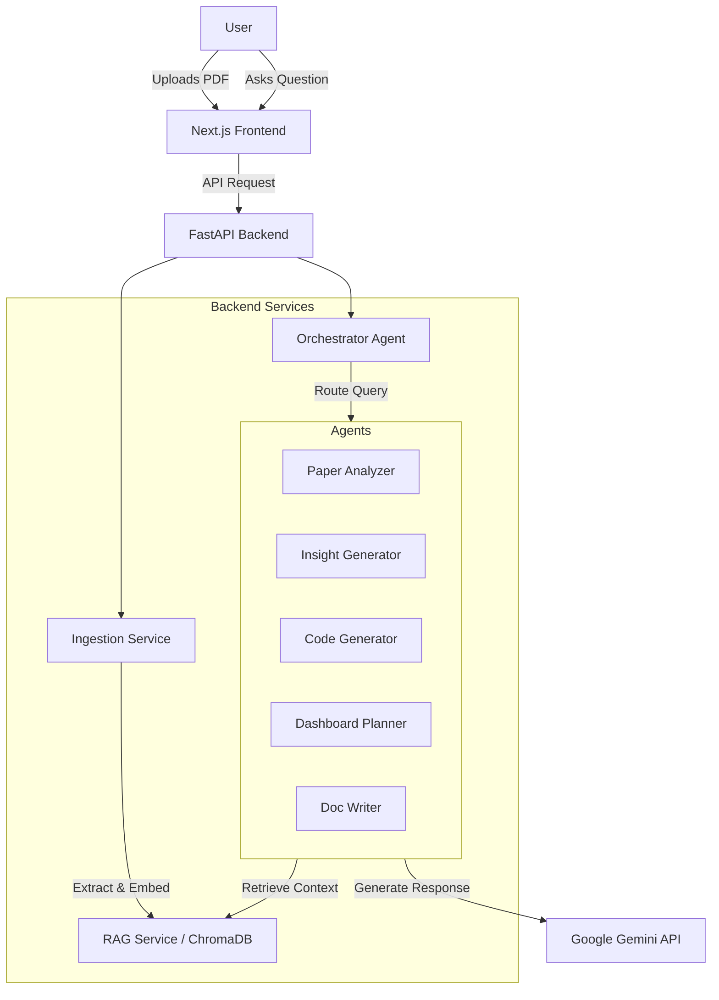

# SN-Insight: AI Research & Productivity Companion

**SN-Insight** is an intelligent multi-agent system designed to accelerate research productivity. It ingests research papers (PDFs), extracts knowledge, and uses specialized AI agents to generate insights, compare papers, write code, and plan dashboards.

## 🚀 Features

-   **📄 PDF Ingestion & RAG**: Upload papers, extract text, and query them using vector search.
-   **🤖 Multi-Agent System**:
    -   **Paper Analyzer**: Summaries, methodology extraction.
    -   **Insight Generator**: Identifies gaps and future scope.
    -   **Comparator**: Compares multiple papers.
    -   **Code Generator**: Auto-generates Python code for EDA/ML.
    -   **Dashboard Planner**: Suggests visualization strategies.
    -   **Doc Writer**: Generates reports and READMEs.
-   **🧠 Intelligent Routing**: An Orchestrator agent routes your query to the best specialist.
    -   **Orchestrator**: Intelligently routes queries to the right specialist.
    -   **Paper Analyzer**: Summaries, key findings, and methodology analysis.
    -   **Insight Generator**: Novel ideas, limitations, and future work suggestions.
    -   **Paper Comparator**: Compare multiple papers (future scope).
    -   **Code Generator**: Generate Python code based on algorithms described in papers.
    -   **Dashboard Planner**: Suggest visualization strategies for data.
    -   **Documentation Writer**: Draft technical documentation or blog posts.
-   **💬 Interactive Chat**: Chat with your research papers via a modern Next.js UI.
-   **⚡ Powered by Gemini**: Uses Google's Gemini 1.5 Pro model for high-quality reasoning.

## 🏗 Architecture



## 🛠 Tech Stack

-   **Frontend**: Next.js 14, TypeScript, TailwindCSS, Framer Motion
-   **Backend**: FastAPI, Python 3.10+
-   **AI/LLM**: LangChain (for orchestration/chains), Google Gemini 1.5 Pro
-   **Vector DB**: ChromaDB
-   **PDF Processing**: pdfplumber

## 🏃‍♂️ Getting Started

### Prerequisites
-   Node.js 18+
-   Python 3.10+
-   Google AI API Key (Get it from https://aistudio.google.com/app/apikey)

### Installation

1.  **Clone the repository**
    ```bash
    git clone https://github.com/yourusername/researchmate-ai.git
    cd researchmate-ai
    ```

2.  **Backend Setup**
    ```bash
    cd backend
    python -m venv venv
    source venv/bin/activate  # On Windows: venv\Scripts\activate
    pip install -r requirements.txt
    
    # Create .env file
    echo "GOOGLE_API_KEY=your_key_here" > .env
    ```

3.  **Frontend Setup**
    ```bash
    cd ../frontend
    npm install
    ```

### Running the Application

You can run both services using the helper script:

```bash
./run.sh
```

Or manually:

**Backend**:
```bash
cd backend
source venv/bin/activate
uvicorn app.main:app --reload
```

**Frontend**:
```bash
cd frontend
npm run dev
```

Visit `http://localhost:3000` to use **ResearchMate AI**.

## 📝 Usage

1.  Open `http://localhost:3000`.
2.  Upload a research paper PDF via the "Research Context" panel.
3.  Ask questions in the chat:
    -   *"Summarize the methodology."*
    -   *"Generate Python code to visualize the dataset."*
    -   *"What are the limitations of this approach?"*
    -   *"Plan a dashboard for these results."*

## 📄 License
MIT
